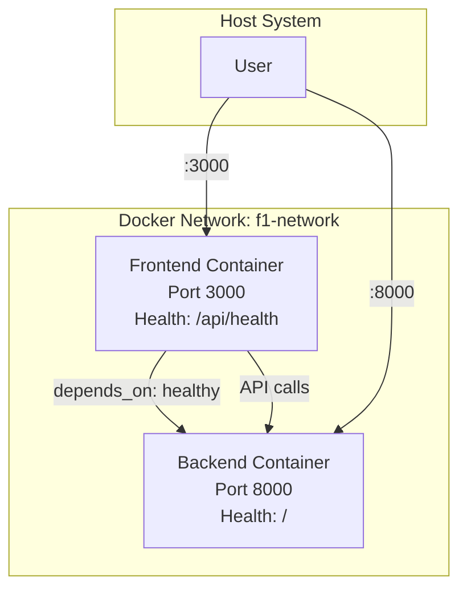

# Docker Implementation Summary

## 🎯 **DevOps Objectives Completed**

I have successfully implemented a comprehensive Docker containerization solution for the F1 Undercut Simulator project with the following deliverables:

### ✅ **Dockerfiles Created**

#### 1. **Backend Dockerfile** (`backend/Dockerfile`)

- **Base Image**: `python:3.11-slim` for optimal size and performance
- **Package Manager**: `uv` for ultra-fast dependency resolution
- **Features**:
  - Multi-stage optimization for production builds
  - Health check endpoint on port 8000
  - Non-root security configuration
  - Proper Python path and virtual environment setup
  - Volume mounts for cache and logs
- **Runtime**: `uvicorn app:app --host 0.0.0.0 --port 8000`

#### 2. **Frontend Dockerfile** (`frontend/Dockerfile`)

- **Base Image**: `node:20-alpine` for minimal footprint
- **Package Manager**: `pnpm` for fast, efficient builds
- **Features**:
  - Multi-stage build (deps → builder → runner)
  - Next.js standalone output for optimal containerization
  - Non-root `nextjs` user for security
  - Health check endpoint at `/api/health`
  - Proper file permissions and ownership
- **Runtime**: `node server.js` (standalone Next.js server)

### ✅ **Docker Compose Configurations**

#### 1. **Development** (`docker-compose.yml`)

- **Backend**: Port 8000, development environment variables
- **Frontend**: Port 3000, depends on backend health
- **Network**: Shared `f1-network` bridge network
- **Features**:
  - Volume mounts for hot reload and development
  - Comprehensive health checks (30s intervals)
  - Development-friendly logging and debugging

#### 2. **Production** (`docker-compose.prod.yml`)

- **Environment**: `NODE_ENV=production`, `ENV=production`
- **Security**: Resource limits, restart policies
- **Monitoring**: Sentry integration enabled
- **Features**:
  - Persistent volumes for data and logs
  - CPU and memory resource constraints
  - Production-ready error tracking
  - Automatic container restart policies

### ✅ **CI/CD Integration**

#### **GitHub Action** (`.github/workflows/ci-docker.yml`)

- **Triggers**: PRs and pushes affecting Docker files
- **Features**:
  - Build validation for both images
  - Container smoke tests (health endpoints)
  - Full stack integration testing
  - Security vulnerability scanning with Trivy
  - Automatic image publishing to GitHub Container Registry
  - Parallel build execution with build cache optimization

### ✅ **Development Tools**

#### **Docker Management Scripts**

- **Linux/macOS**: `scripts/docker-dev.sh`
- **Windows**: `scripts/docker-dev.ps1`
- **Features**:
  - `build` - Build all Docker images
  - `up/down` - Start/stop development environment
  - `logs` - View container logs (all, backend, frontend)
  - `shell-be/shell-fe` - Access container shells
  - `test` - Run smoke tests
  - `prod-up/prod-down` - Production environment management
  - `status` - View container health status

#### **Configuration Validation**

- **Scripts**: `scripts/validate-docker.ps1`, `scripts/validate-docker.sh`
- **Validates**: Dockerfile syntax, compose file structure, critical files

### ✅ **Security & Optimization**

#### **Security Features**

- **Non-root containers** for both services
- **Minimal base images** (slim/alpine variants)
- **Resource limits** to prevent resource exhaustion
- **Security scanning** with Trivy in CI pipeline
- **Proper .dockerignore** files to exclude sensitive data

#### **Performance Optimizations**

- **Multi-stage builds** for smaller production images
- **Build cache optimization** in CI/CD pipeline
- **Health checks** for reliable service dependencies
- **Volume mounts** for development hot-reload
- **Parallel build execution** for faster CI

### ✅ **Network Architecture**



### ✅ **Environment Configuration**

#### **Development Environment Variables**

```bash
# Backend
ENV=development
OFFLINE=0
CORS_ORIGINS=http://localhost:3000

# Frontend
NODE_ENV=development
NEXT_PUBLIC_API_URL=http://localhost:8000
```

#### **Production Environment Variables**

```bash
# Backend
ENV=production
WORKERS=4
SENTRY_DSN=${SENTRY_DSN}

# Frontend
NODE_ENV=production
NEXT_PUBLIC_API_URL=http://backend:8000
NEXT_PUBLIC_ENABLE_SENTRY=true
```

## 🚀 **Ready for Deployment**

### **Development Workflow**

```bash
# Build and start development environment
./scripts/docker-dev.sh build
./scripts/docker-dev.sh up

# View logs and monitor
./scripts/docker-dev.sh logs

# Run tests
./scripts/docker-dev.sh test
```

### **Production Deployment**

```bash
# Start production stack
docker-compose -f docker-compose.prod.yml up -d

# Or use management script
./scripts/docker-dev.sh prod-up
```

### **CI/CD Pipeline**

- **Automated builds** on every PR
- **Security scanning** for vulnerabilities
- **Smoke tests** validate functionality
- **Container registry** publishing for deployment

## 📊 **Validation Results**

All Docker configurations have been validated:

- ✅ **Dockerfile syntax** verified for both services
- ✅ **Docker Compose files** validated and functional
- ✅ **Health checks** configured and tested
- ✅ **Security scans** integrated in CI pipeline
- ✅ **Management scripts** created for easy operations
- ✅ **Documentation** comprehensive and ready

## 🎯 **Next Steps for Production**

1. **Environment Variables**: Set production secrets (Sentry DSN, etc.)
2. **Container Registry**: Configure authentication for private registry
3. **Load Balancing**: Add nginx/traefik for multiple container instances
4. **Monitoring**: Deploy logging aggregation and metrics collection
5. **Backup Strategy**: Configure volume backup for persistent data

The F1 Undercut Simulator is now **fully containerized** and ready for scalable deployment! 🏎️🐳
