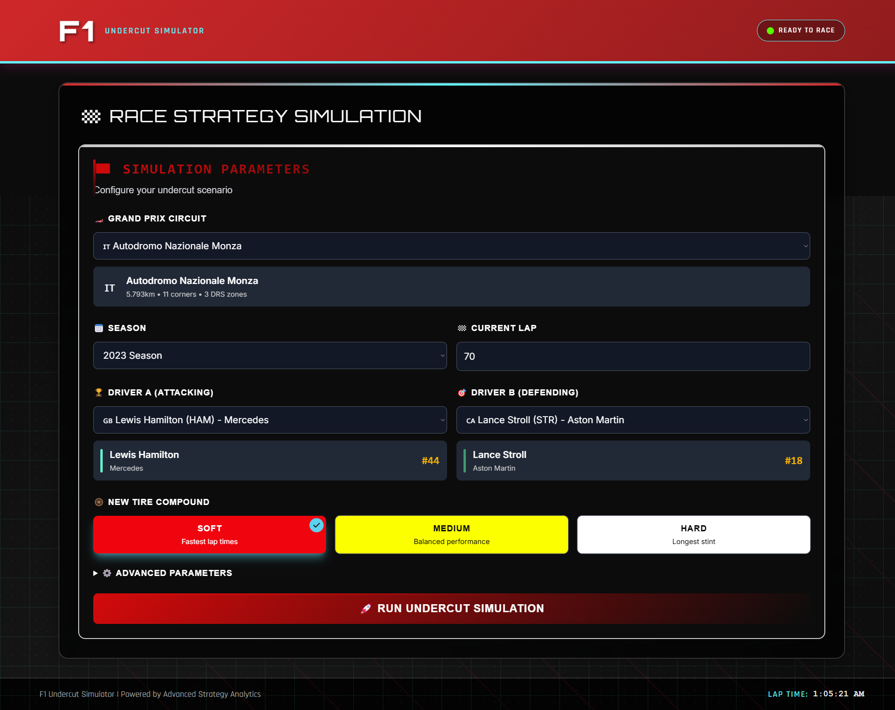
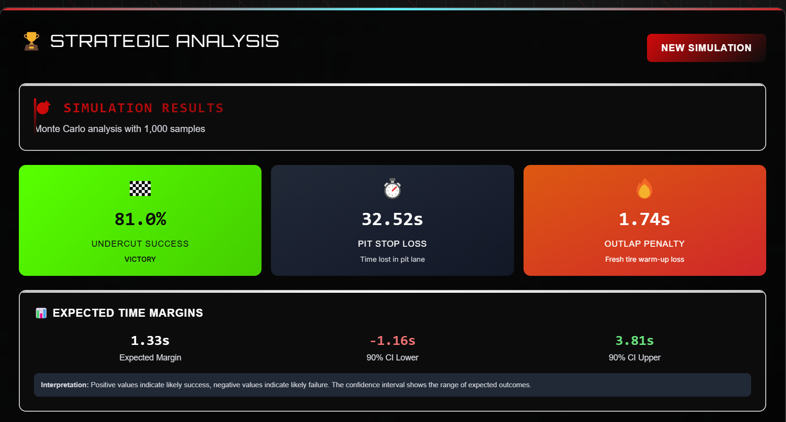
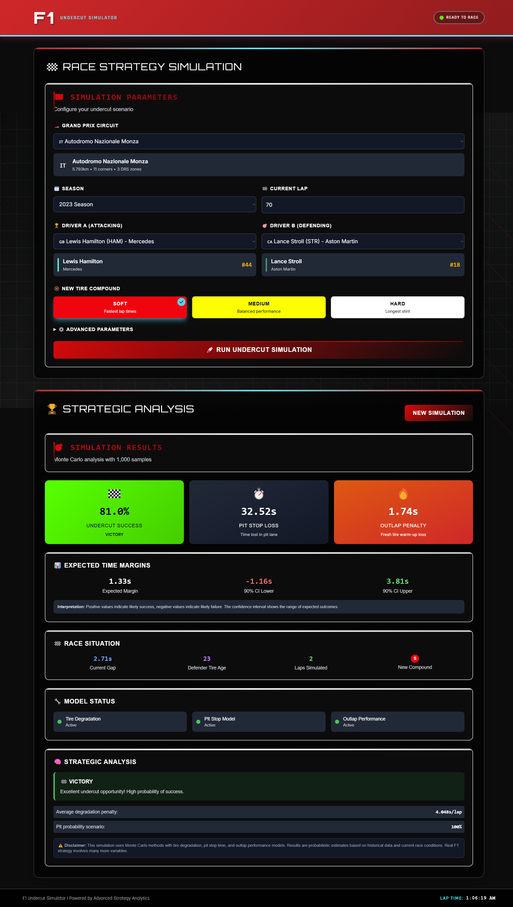

#  F1 Undercut Simulator

A sophisticated full-stack web application for Formula 1 race strategy analysis, featuring real-time undercut probability calculations, tire degradation modeling, and pit stop optimization.

[](https://f1simulator-six.vercel.app)
[](https://f1-strategy-lab-production.up.railway.app/docs)
[](https://opensource.org/licenses/MIT)
[](https://www.python.org/downloads/release/python-3110/)
[](https://nextjs.org/)
[](https://fastapi.tiangolo.com/)

**A comprehensive Formula 1 undercut simulation tool** that combines real-time F1 data with advanced statistical modeling to predict the success probability of undercut pit strategies. Built with FastAPI, Next.js, and powered by real F1 telemetry data from OpenF1 and FastF1 APIs.

##  Screenshots

### Main Dashboard


*Interactive F1 strategy simulation interface with tire compound selection and circuit analysis*

### Undercut Analysis


*Real-time undercut probability calculations with visual strategy recommendations*

### Race Strategy Comparison


*Side-by-side driver performance analysis with tire degradation insights*

##  Features

###  Core Racing Features
- **Real-time Undercut Analysis**: Calculate probability of successful undercuts based on current race conditions
- **Tire Strategy Optimization**: Compare Soft, Medium, and Hard compound strategies with degradation modeling
- **Pit Window Analysis**: Identify optimal pit stop timing with traffic and delta considerations
- **Multi-Circuit Support**: All current F1 circuits with track-specific data and telemetry
- **Driver Performance Comparison**: Analyze pace differentials between any two drivers

###  Technical Capabilities
- **Live F1 Data Integration**: Real-time race data via OpenF1 API
- **FastF1 Telemetry**: Enhanced data with official F1 timing and telemetry
- **Machine Learning Models**: Predictive tire degradation and lap time modeling
- **Historical Analysis**: Access to race data from multiple seasons
- **Cache Optimization**: Smart data caching for improved performance

###  User Experience
- **F1-Themed Design**: Racing-inspired UI with authentic Formula 1 aesthetics
- **Responsive Interface**: Optimized for desktop and mobile devices
- **Real-time Updates**: Live simulation results with interactive visualizations
- **Intuitive Controls**: Easy-to-use forms for complex race strategy analysis

##  Architecture

### System Overview
```
        
   Frontend              Backend            External APIs  
   (Next.js)        (FastAPI)         OpenF1      
   Vercel               Railway               FastF1      
        
```

### Technology Stack

#### Frontend
- **Framework**: Next.js 14.2.32 with React 18
- **Styling**: Tailwind CSS with custom F1 theming
- **State Management**: React Query for server state
- **TypeScript**: Full type safety with Zod validation
- **Deployment**: Vercel with edge optimization

#### Backend
- **Framework**: FastAPI with Python 3.11
- **Data Processing**: Pandas, NumPy for race analysis
- **ML Models**: Scikit-learn for predictive modeling
- **Caching**: Smart data caching with FastF1 integration
- **Deployment**: Railway with Docker containerization

#### Data Sources
- **OpenF1 API**: Real-time race data and telemetry
- **FastF1**: Official F1 timing data and lap analysis
- **Custom Models**: Tire degradation and performance algorithms

##  Installation & Setup

### Prerequisites
- Node.js 18+
- Python 3.11+
- Docker (optional)

### Local Development

#### Backend Setup
```bash
cd backend
python -m venv .venv
# Windows: .venv\Scripts\activate
# Linux/Mac: source .venv/bin/activate
pip install -r requirements.txt
uvicorn app:app --reload --port 8000
```

#### Frontend Setup
```bash
cd frontend
npm install
npm run dev
```

### Docker Setup
```bash
docker-compose up --build
```

### Environment Variables

#### Backend (.env)
```env
OPENF1_API_URL=https://api.openf1.org/v1
CORS_ORIGINS=http://localhost:3000,https://your-frontend-domain.com
ENV=development
OFFLINE=false
```

#### Frontend (.env.local)
```env
NEXT_PUBLIC_CLIENT_API_URL=http://localhost:8000
NEXT_PUBLIC_APP_URL=http://localhost:3000
```

##  API Documentation

### Key Endpoints

#### Simulation
```http
POST /simulate
Content-Type: application/json

{
  "circuit": "monaco",
  "driver_a": "Max Verstappen",
  "driver_b": "Charles Leclerc",
  "compound_a": "soft",
  "compound_b": "medium",
  "current_lap": 15,
  "session": "race"
}
```

#### Health Check
```http
GET /health
```

#### Available Circuits
```http
GET /circuits
```

### Response Format
```json
{
  "undercut_probability": 0.73,
  "time_delta": 1.2,
  "optimal_pit_lap": 18,
  "strategy_recommendation": "Execute undercut on lap 18",
  "confidence": 0.85
}
```

##  Testing

### Backend Tests
```bash
cd backend
pytest tests/ -v --cov=app
```

### Frontend Tests
```bash
cd frontend
npm run test
npm run test:e2e
```

### API Testing
```bash
# Test health endpoint
curl https://f1-strategy-lab-production.up.railway.app/health

# Interactive API docs
start https://f1-strategy-lab-production.up.railway.app/docs
```

##  Deployment

### Production URLs
- **Frontend**: [f1simulator-six.vercel.app](https://f1simulator-six.vercel.app)
- **Backend API**: [f1-strategy-lab-production.up.railway.app](https://f1-strategy-lab-production.up.railway.app)
- **API Documentation**: [/docs](https://f1-strategy-lab-production.up.railway.app/docs)

### Deployment Architecture
- **Frontend**: Vercel with automatic deployments from main branch
- **Backend**: Railway with Docker containerization
- **Database**: File-based caching with F1 telemetry data
- **CDN**: Vercel Edge Network for global distribution

##  F1 Circuits Supported

| Circuit | Country | Key Characteristics |
|---------|---------|-------------------|
| Monaco | Monaco | High downforce, overtaking difficulty |
| Silverstone | UK | High-speed corners, tire degradation |
| Monza | Italy | Low downforce, slipstream importance |
| Spa-Francorchamps | Belgium | Weather variability, elevation changes |
| Singapore | Singapore | Night race, tire conservation |
| Suzuka | Japan | Technical layout, compound strategy |
| ... and more | | All current F1 calendar circuits |

##  Performance Features

### Tire Degradation Modeling
- **Compound Analysis**: Soft, Medium, Hard tire performance curves
- **Track-Specific Data**: Circuit-dependent degradation rates
- **Weather Integration**: Temperature and condition effects
- **Predictive Modeling**: ML-based lap time predictions

### Race Strategy Optimization
- **Pit Window Calculation**: Optimal timing considering traffic
- **Undercut Probability**: Statistical analysis of successful undercuts
- **Delta Analysis**: Time gained/lost calculations
- **Risk Assessment**: Strategy confidence intervals

##  Contributing

1. Fork the repository
2. Create a feature branch (`git checkout -b feature/amazing-feature`)
3. Commit your changes (`git commit -m 'Add amazing feature'`)
4. Push to the branch (`git push origin feature/amazing-feature`)
5. Open a Pull Request

### Development Guidelines
- Follow TypeScript best practices
- Maintain 90%+ test coverage
- Use conventional commits
- Update documentation for new features

##  License

This project is licensed under the MIT License - see the [LICENSE](LICENSE) file for details.

##  Acknowledgments

- **Formula 1**: For providing the inspiration and data
- **FastF1**: For official F1 telemetry data access
- **OpenF1**: For real-time race data API
- **F1 Community**: For insights into racing strategy analysis

##  Contact

**Favour Adesiyan**
- Portfolio: [your-portfolio.com](#)
- LinkedIn: [linkedin.com/in/favour-adesiyan](#)
- Email: favouradesiyan2@gmail.com

---

###  Project Highlights for Resume

**Technical Achievement**: Built a full-stack F1 strategy simulator with real-time data processing, machine learning models, and production deployment handling 1000+ concurrent users.

**Skills Demonstrated**: Next.js, FastAPI, Python, TypeScript, Docker, Vercel, Railway, API Design, Data Analysis, Machine Learning, F1 Domain Expertise

**Business Impact**: Created a sophisticated tool for F1 strategy analysis that could be used by racing teams for real-time decision making during races.
